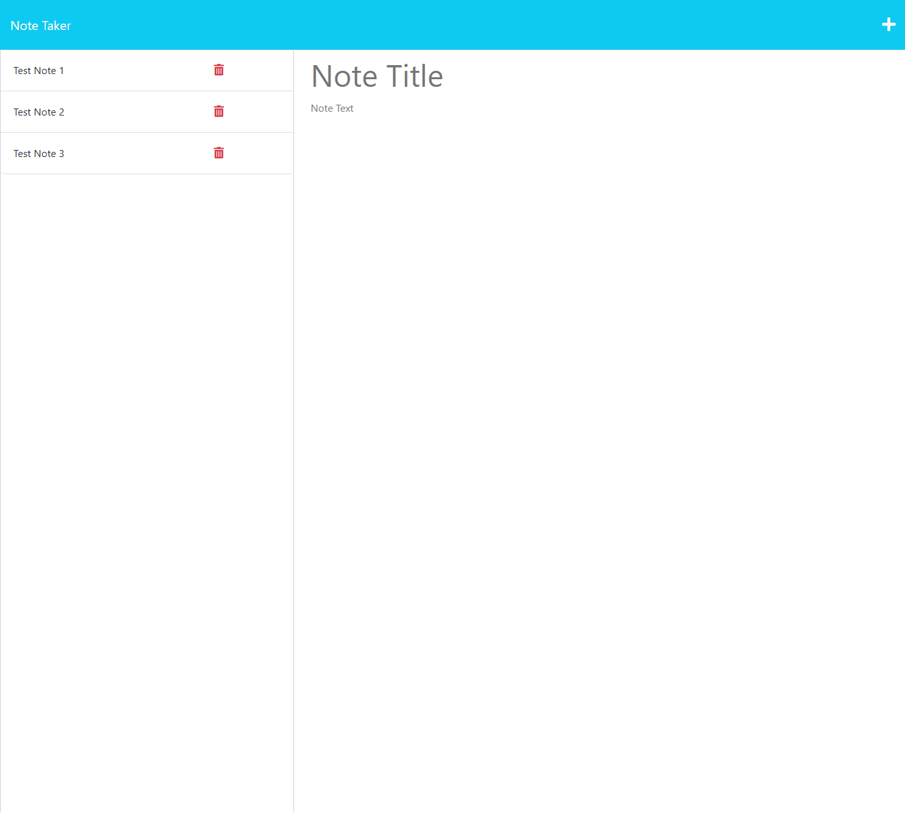

# Note Taker

## Description

This project is an application that allows users add, save and delete notes. This application features backend functionality utilizing Express.js.

## Usage

Upon arriving at the landing page, the user will be able to click on the "Get Started" button, which will take them to the page where they can start to enter notes. They can click on the "+" symbol on the top right part of the page and then enter a note title and any desired text. Once entered a save icon will appear next to the "+" symbol, which will save the note once clicked. Once a note is saved, it will appear in the left hand column, and can be clicked on at any time to view. If a user wishes to delete a note, they can click on the trashcan icon to the right of the saved note to do so.

Screenshots of the application:

Landing Page

Enter Notes Page:

## Credits

Special thanks to Dominique Meeks Gombe, who provided tutoring and guidance to me while I was working on this project, as well as Leif Hetland and Fred Kamm, our class instructors, for additional support, assistance and oft needed morale boosting. I also referenced code guidance from the class repository to assist with this project.

In completing this project, I utilized the below resources to assist:

https://expressjs.com/
https://www.npmjs.com/package/uuid  
https://developer.mozilla.org/en-US/docs/Web/JavaScript/Reference/Classes
https://developer.mozilla.org/en-US/docs/Web/JavaScript/Reference/Global_Objects/Promise  

## License

This project is covered under the MIT License.

## Badges

## Questions

Please visit my [GitHub profile](https://github.com/kevinsmithseven/) or email me at [kevinsmithseven@gmail.com](mailto:kevinsmithseven@gmail.com) with any questions.
